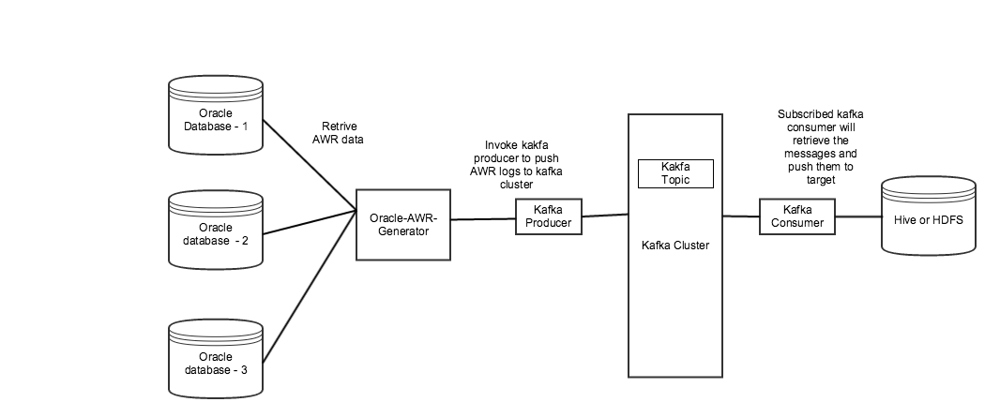

# Oracle-AWR-Generator #

This project is for generating AWR (automation workload repository) data from Oracle database and load into any target system (such as hdfs or hive) for analysis.
AWR captures Oracle database stats. For more info regarding Oracle AWR, refer to this link.

https://docs.oracle.com/cd/E11882_01/server.112/e41573/autostat.htm#PFGRF02601

The AWR data is loaded by each snapshot and the solution loads all snapshots data for the current day it runs. To leverage concurrency in loading
the AWR data, the generate_awr.py spawns multiple threads and each thread work on extracting one snapshot data at a time.

Also, we used a messaging solution, Apache Kafka, to assist in pushing the AWR data to its final destination. 

##Architecture

##Installation Instructions
1.  Clone the repo to your machine.
    git clone https://github.com/varmarakesh/oracle-awr-generator
2.  Make sure python 2.7 is installed and install the required libraries.
    pip install -r /oracle-awr-generator/deploy/requirements.txt
3.  Make sure oracle client is installed on your local system.
4.  update the config.ini with oracle connection info and kafka cluster info.
5.  python generate_awr.py

This has been tested so far using python 2.7 on mac osx 10.9.5 and centos 7